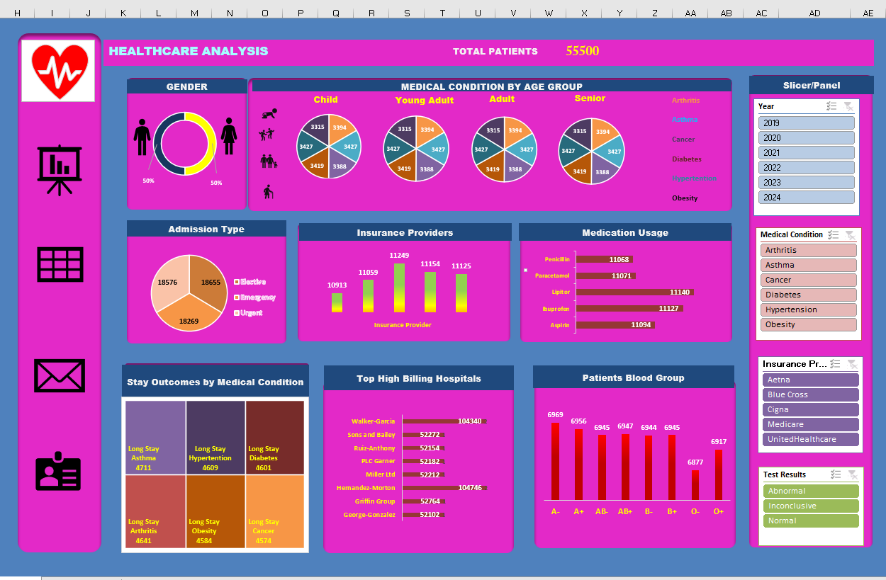

# Healthcare-Analysis

📊 Overview

An interactive Healthcare Dashboard (Excel-based) for analyzing patient data, medical conditions, and hospital performance. It provides quick insights into trends, demographics, and treatment patterns.

🚀 Live Dashboard

👉 View here:
🔗 https://1drv.ms/x/c/723f1bcb48e8eed5/IQTc8oYcnc9bSpeAWylJ8U8OAXwo7jSnlfH-karBM8etPLI?em=2

✨ Key Features
Patient overview (55K+ records)
Gender & age-group analysis
Admission types (Emergency, Elective, Urgent)
Medication usage & insurance insights
Top billing hospitals
Blood group & stay duration analysis

🎛️ Filters

Year (2019–2024)
Medical Conditions
Insurance Providers
Test Results

🛠️ Tools Used

Microsoft Excel
Pivot Tables & Charts
Data Visualization

📸 Preview

📈 Insights

Balanced gender distribution
Chronic diseases → longer stays
Emergency cases form a large share
Few hospitals drive high billing
